## Setup incremental copy of the data

- Create dataflow to load data from given storage and write to destinated storage

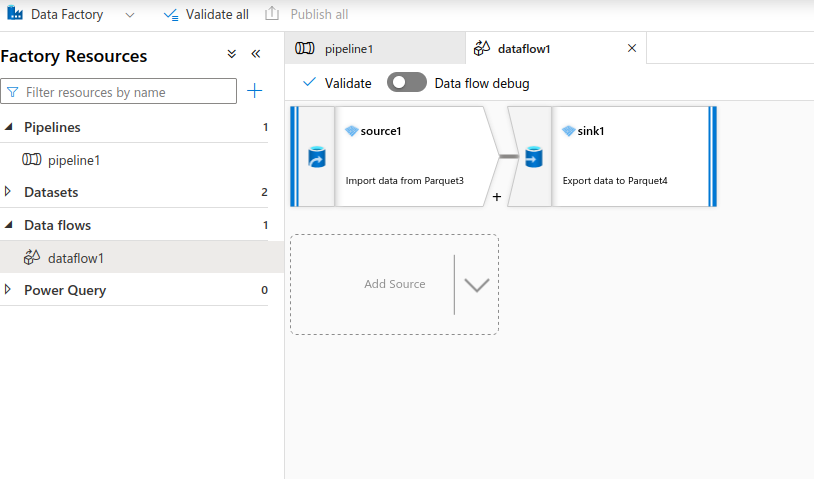

- Create trigger to load data every `n` minutes (10 for example)

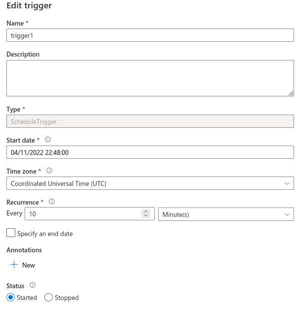

- Completed trigger runs

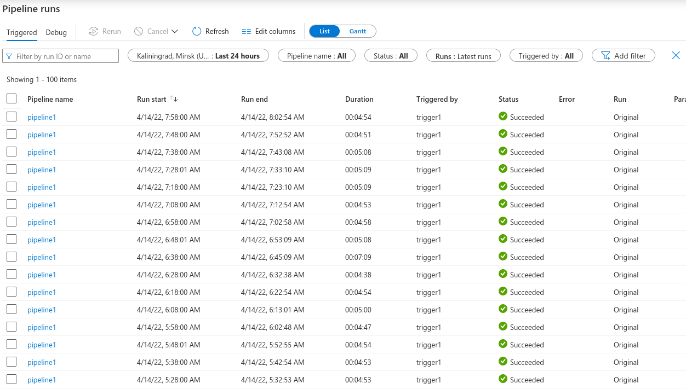

## Setup data streaming

- Mount Azure storage using dbutils with secret scope

```scala
dbutils.fs.mount(
  source = "wasbs://data@stavalswesteurope.blob.core.windows.net",
  mountPoint = "/mnt/hotel-weather",
  extraConfigs = Map("fs.azure.sas.data.stavalswesteurope.blob.core.windows.net" -> dbutils.secrets.get(scope="sparkstreaming", key="storagekey")))
```

- Read schema

```scala
val schema = spark.read.parquet("/mnt/hotel-weather").schema
```

- Start data streaming

```scala
val checkpoint_path = "/tmp/delta/hotel_data/_checkpoints"
val write_path = "/tmp/delta/hotel_data"

// Set up the stream to begin reading incoming files from the
// upload_path location.
val df = spark.readStream.format("parquet")
  .schema(schema)
  .load("/mnt/hotel-weather")

// Start the stream.
// Use the checkpoint_path location to keep a record of all files that
// have already been uploaded to the upload_path location.
// For those that have been uploaded since the last check,
// write the newly-uploaded files' data to the write_path location.
df.writeStream.format("delta")
  .option("checkpointLocation", checkpoint_path)
  .start(write_path)
```

## Spark SQL

- Read data from write_path location

```scala
val df_hotel_weather = spark.read.format("delta").load(write_path)
```

- Use spark sql to get avg, max, min temperature and distinct amount of hotels by city and day 

```sql
SELECT city, 
       wthr_date, 
       count(distinct(name, wthr_date)) AS distinct_hotels_amount,
       AVG(avg_tmpr_c) as avg_tmpr,
       MAX(avg_tmpr_c) as max_tmpr,
       MIN(avg_tmpr_c) as min_tmpr
FROM hotel_weather
GROUP BY city, wthr_date 
ORDER BY distinct_hotels_amount DESC
```

- Get top 10 biggest cities

```sql
SELECT city, 
       count(distinct(name)) AS all_distinct_hotels
FROM hotel_weather 
GROUP BY city 
ORDER BY all_distinct_hotels DESC 
LIMIT 10
```

- Inner join 2 Dataframes and rank them according to city

```sql
SELECT hotels_by_day_and_city.city, 
       hotels_by_day_and_city.wthr_date, 
       hotels_by_day_and_city.distinct_hotels_amount,
       avg_tmpr,
       max_tmpr,
       min_tmpr,
       dense_rank() over(ORDER BY hotels_by_day_and_city.city ASC) AS rank
FROM hotels_by_day_and_city
INNER JOIN all_hotels_amount
ON all_hotels_amount.city = hotels_by_day_and_city.city
GROUP BY hotels_by_day_and_city.city, 
         hotels_by_day_and_city.wthr_date, 
         hotels_by_day_and_city.distinct_hotels_amount,
         avg_tmpr,
         max_tmpr,
         min_tmpr
```

- Get graph for each city (rank from 1 to 10)

```sql
SELECT * 
FROM joined_hotels 
WHERE rank = 1 
ORDER BY wthr_date ASC
```

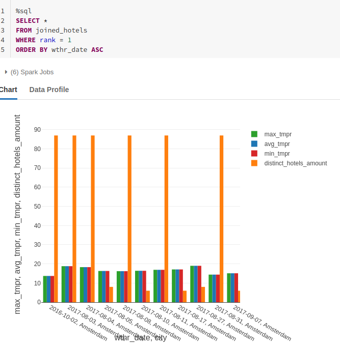

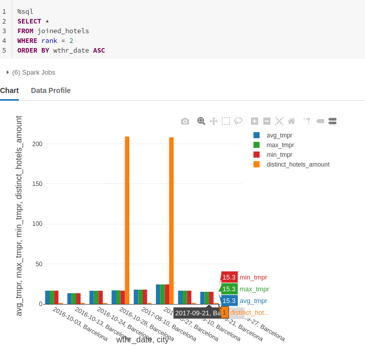

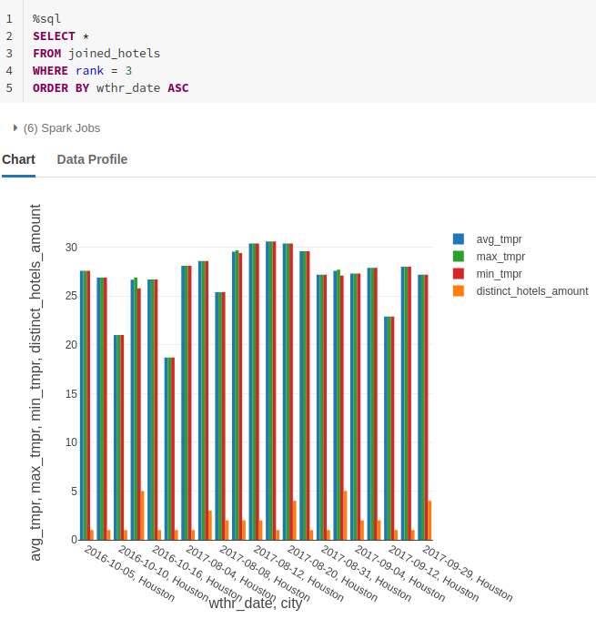

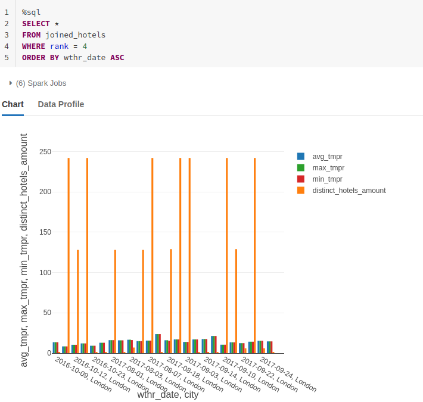

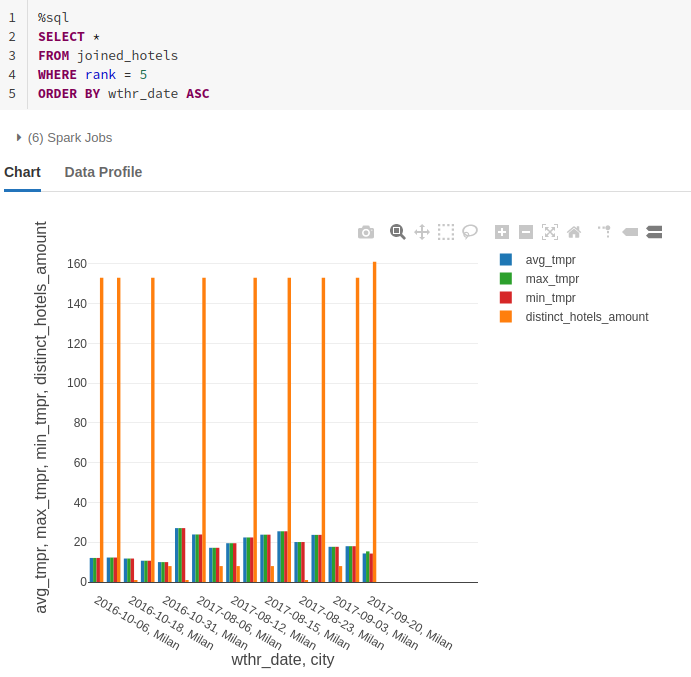

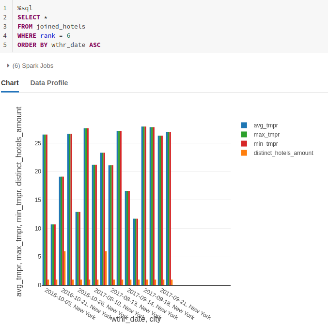

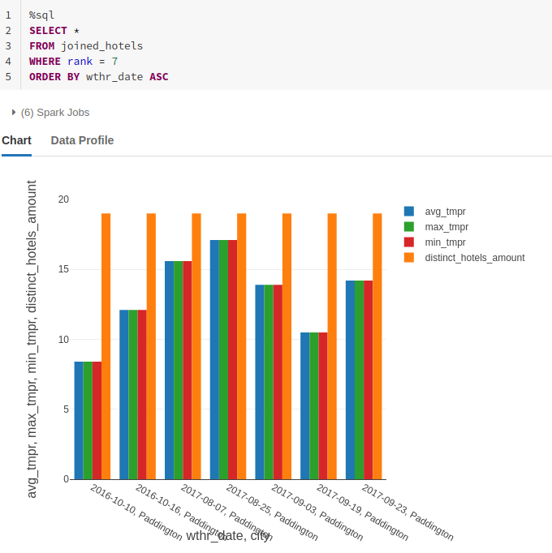

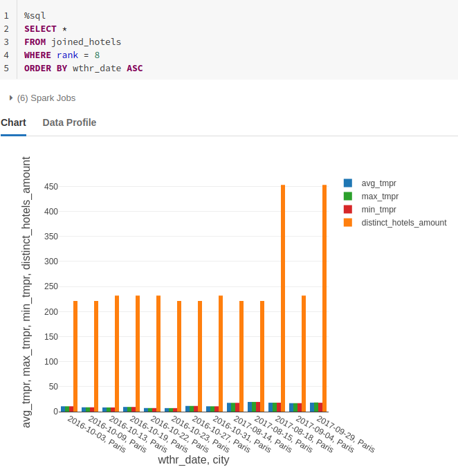

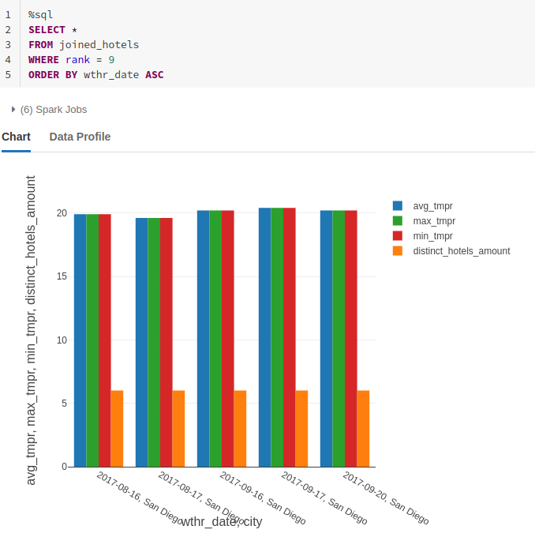

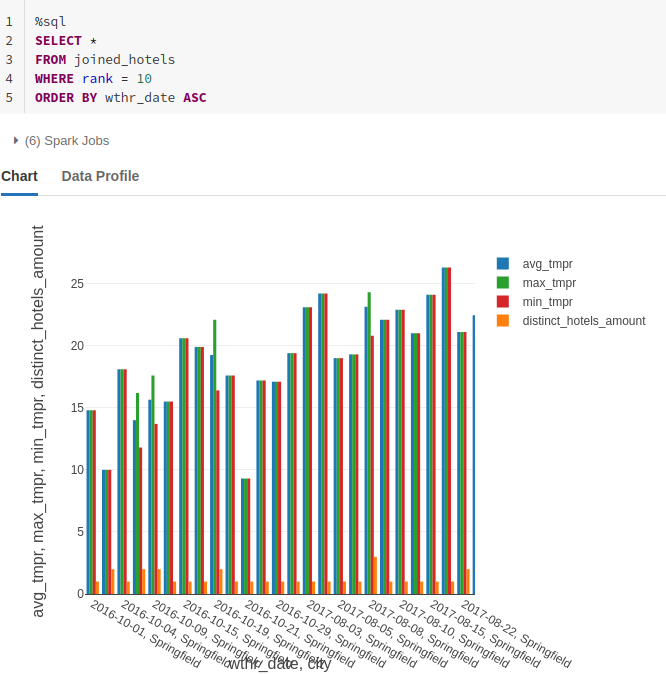

## Deploy notebook with terraform script

```
# Setup azurerm as a state backend
terraform {
  backend "azurerm" {
      resource_group_name = "terraformrg"
      storage_account_name = "terraformsalab"
      container_name = "terraform"
      key = "databricksNotebook.tfstate"
  }
}

# Configure the Microsoft Azure Provider
provider "azurerm" {
  features {}
}

data "azurerm_client_config" "current" {}

provider "databricks" {
  host = var.DATABRICKS_URL
}

data "databricks_current_user" "me" {}

resource "databricks_notebook" "sparkStreamingHomework" {
  source = "${path.module}/${var.SOURCE_FILE_PATH}"
  path   = "/Shared/m13sparkstreaming"
}

output "notebook_url" {
  value = databricks_notebook.sparkStreamingHomework.url
}
```